# ThingsBoard IoT Platform Project

This project demonstrates the implementation and configuration of the ThingsBoard IoT Platform using Docker Compose. It covers everything from basic IoT concepts to advanced device monitoring and mobile connectivity.

## Table of Contents
- [1. The IoT](#1-the-iot)
- [2. What is an IoT Platform?](#2-what-is-an-iot-platform)
- [3. Introduction to ThingsBoard](#3-introduction-to-thingsboard)
- [4. ThingsBoard Key Features](#4-thingsboard-key-features)
- [5. System Architecture](#5-system-architecture)
- [6. Installation Guide](#6-installation-guide)
- [7. Configuration and Usage Guide](#7-configuration-and-usage-guide)
- [8. Configuration Steps](#8-configuration-steps)
    - [8.1. Docker Compose Initialization](#81-docker-compose-initialization)
    - [8.2. Container Status Verification](#82-container-status-verification)
    - [8.3. Authentication and Portal Access](#83-authentication-and-portal-access)
    - [8.4. Centralized Management Dashboard](#84-centralized-management-dashboard)
    - [8.5. Device Profile Templates](#85-device-profile-templates)
    - [8.6. Transport and Queue Configuration](#86-transport-and-queue-configuration)
    - [8.7. Condition-Based Alarm Rules](#87-condition-based-alarm-rules)
    - [8.8. Manual Device Provisioning](#88-manual-device-provisioning)
    - [8.9. Mapping Device to Profile](#89-mapping-device-to-profile)
    - [8.10. Device Security and Credentials](#810-device-security-and-credentials)
    - [8.11. Access Token Generation](#811-access-token-generation)
    - [8.12. HTTP Telemetry API Endpoint](#812-http-telemetry-api-endpoint)
    - [8.13. MQTT Transport Configuration](#813-mqtt-transport-configuration)
    - [8.14. CoAP Protocol Support](#814-coap-protocol-support)
    - [8.15. Real-Time Telemetry Monitoring](#815-real-time-telemetry-monitoring)
    - [8.16. Advanced Metric Visualization](#816-advanced-metric-visualization)
    - [8.17. Gauge and Index Tuning](#817-gauge-and-index-tuning)
    - [8.18. Widget Selection Library](#818-widget-selection-library)
    - [8.19. Historical Trend Analysis](#819-historical-trend-analysis)
    - [8.20. Mapping Data Keys to Visuals](#820-mapping-data-keys-to-visuals)
    - [8.21. Detailed Widget Data Configuration](#821-detailed-widget-data-configuration)
    - [8.22. Time Window and Refresh Cycles](#822-time-window-and-refresh-cycles)
    - [8.23. Device Telemetry Simulation](#823-device-telemetry-simulation)
    - [8.24. Global Device Fleet Status](#824-global-device-fleet-status)
    - [8.25. Public Dashboard Visibility](#825-public-dashboard-visibility)
    - [8.26. External Access URL Generation](#826-external-access-url-generation)
    - [8.27. Public Data Permissions](#827-public-data-permissions)
    - [8.28. Live Public Monitoring View](#828-live-public-monitoring-view)
    - [8.29. Mobile Application Setup](#829-mobile-application-setup)
    - [8.30. Responsive Mobile Layouts](#830-responsive-mobile-layouts)
    - [8.31. QR Code Pairing](#831-qr-code-pairing)
    - [8.32. Mobile Authentication Success](#832-mobile-authentication-success)
    - [8.33. MobileField Monitoring on Smartphone](#833-mobilefield-monitoring-on-smartphone)

---

## 1. The IoT 
The Internet of Things (IoT) represents a massive shift in how we interact with the physical world. It involves connecting billions of devices to the internet to gather data and automate processes. For companies, this phenomenon brings challenges like managing massive amounts of data, ensuring security, and scaling thousands of sensors. 

**How an IoT Platform helps:**
An IoT Platform like ThingsBoard helps companies overcome these challenges by providing a centralized hub for device management, data processing, and visualization. It acts as the "brain" of the operation, allowing businesses to focus on their use cases rather than building infrastructure from scratch.

## 2. What is an IoT Platform?
An IoT Platform is a middleware layer that sits between sensors (devices) and end-user applications. It provides essential services such as device connectivity, data storage, security authentication, and a rule engine for automation. It simplifies the complexity of connecting diverse hardware to various cloud services.

## 3. Introduction to ThingsBoard
ThingsBoard is an open-source IoT platform for data collection, processing, visualization, and device management. It is highly scalable, fault-tolerant, and supports both cloud and on-premises deployments. It enables developers to build professional IoT solutions with minimal effort.

## 4. ThingsBoard Key Features
- **Device Management:** Provision, monitor, and control thousands of IoT devices.
- **Data Collection:** Collect and store data from sensors in a scalable way.
- **Visualization:** Build beautiful, interactive dashboards to monitor real-time data.
- **Rule Engine:** Create complex logic for data processing and alerts without writing code.
- **Multi-tenancy:** Support multiple customers and users securely.
- **Security:** Robust authentication and authorization for devices and users.
- **Multiple Connectivity:** Support for multiple protocols including HTTP, MQTT, and HTTP to ensure flexible device integration.
- **Mobile Support:** Access dashboards and monitor devices on the go with dedicated mobile application support for Android and iOS.

## 5. System Architecture
ThingsBoard uses a microservices-ready architecture that ensures high availability and scalability. Below is the architectural diagram showing how devices connect to the platform services and how data flows to the database.

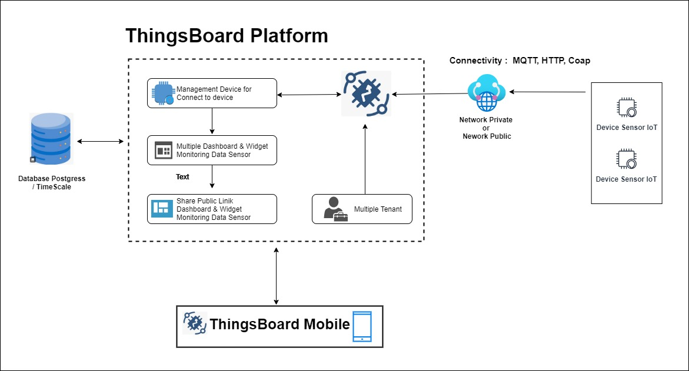

The architecture includes the Transport layer (MQTT, HTTP, CoAP), the Core services for processing logic, and the Database layer (PostgreSQL) for persistent storage.

## 6. Installation Guide

### Prerequisites
- Docker and Docker Compose installed on your system.

### Steps
1. **Initialize the Database:**
   Run the following command to install the database schema and load demo data:
   ```bash
   docker compose run --rm -e INSTALL_TB=true -e LOAD_DEMO=true thingsboard-ce
   ```

2. **Start the Platform:**
   Start all services in the background:
   ```bash
   docker compose up -d
   ```

3. **Access the Dashboard:**
   Open your browser and go to `http://localhost:8080`.

**Default Credentials:**
- **System Administrator:** `sysadmin@thingsboard.org` / `sysadmin`
- **Tenant Administrator:** `tenant@thingsboard.org` / `tenant`
- **Customer User:** `customer@thingsboard.org` / `customer`

## 7. Configuration and Usage Guide
All configuration steps, from setting up device profiles to creating public dashboards, are documented through the screenshots in the `ss/` folder.

## 8. Configuration Steps

Below are the detailed explanations for each step of the configuration process, ordered by the numerical sequence of the screenshots.

### 8.1. Docker Compose Initialization
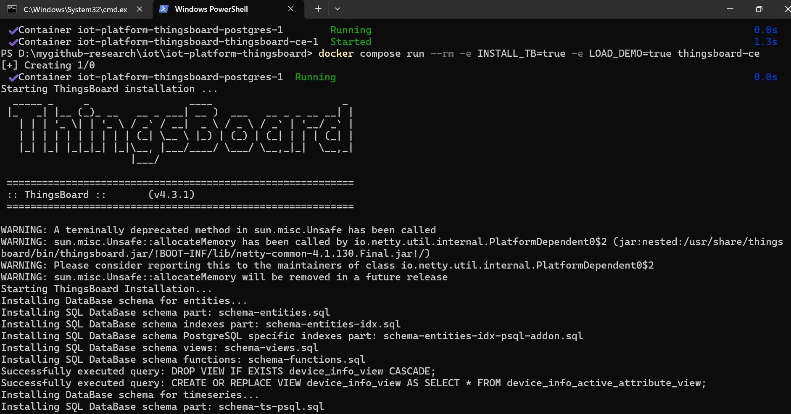
This screenshot shows the initial execution of the Docker Compose commands in the terminal. You can see the containers being pulled and started, confirming that the environment is being set up correctly for the ThingsBoard service and its PostgreSQL database dependency.

### 8.2. Container Status Verification
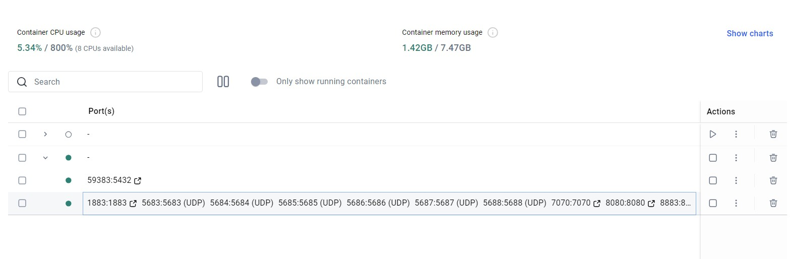
This image displays the status of the running containers after the `docker compose up` command. It verifies that both the database and the ThingsBoard application are up and running, showing the port mappings and health status essential for a stable installation.

### 8.3. Authentication and Portal Access
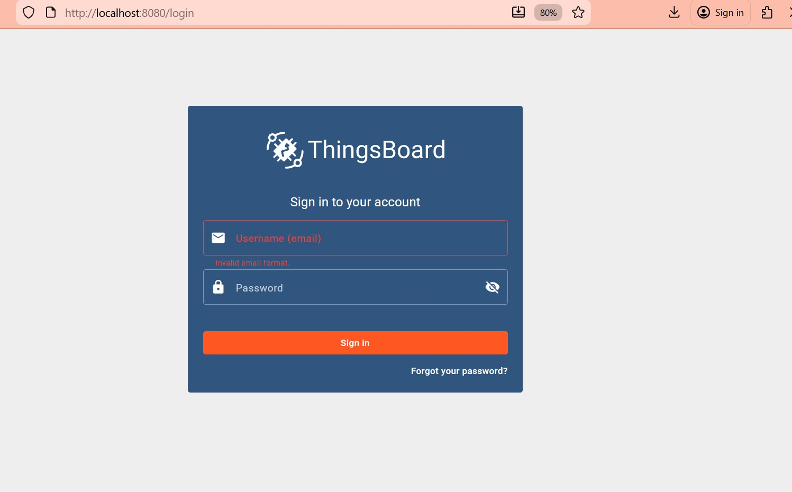
The login screen is the primary entry point for managing the platform. Here, users enter their credentials to access different levels of the system, such as System Administrator or Tenant Administrator, depending on their role and permissions within the project.

### 8.4. Centralized Management Dashboard
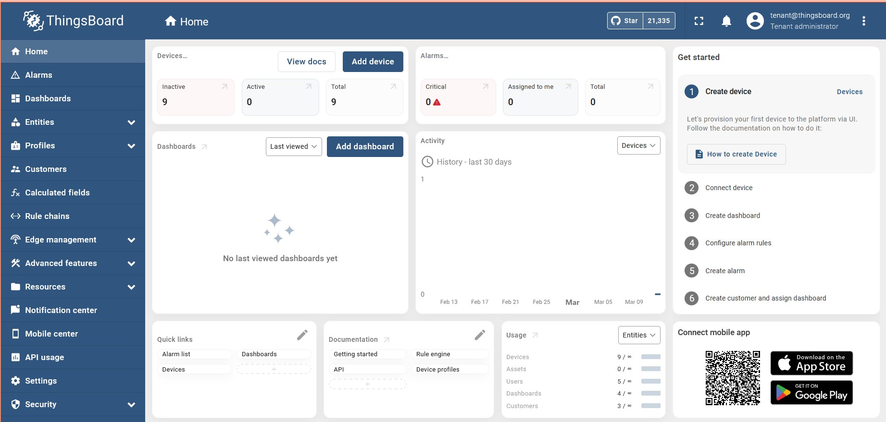
The main dashboard overview provides a high-level summary of the system's state. It shows active devices, recent alerts, and navigation links to various modules like Device Groups, Asset Groups, and Rule Chains, giving the administrator full control over the entire IoT ecosystem.

### 8.5. Device Profile Templates
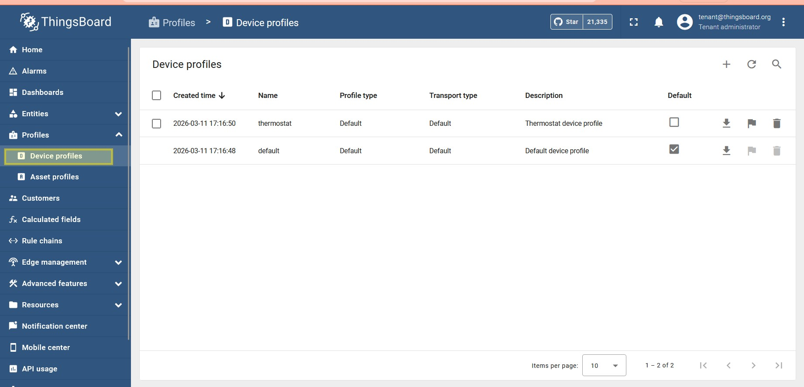
This screen shows the list of Device Profiles. Device profiles act as templates for similar devices, defining common settings, metadata, and rule engine processing logic. This feature is crucial for maintaining consistency when scaling up to hundreds or thousands of similar sensors.

### 8.6. Transport and Queue Configuration
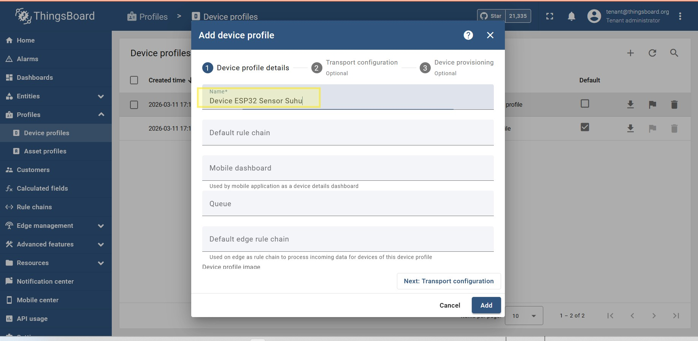
In this step, we are editing a specific device profile. The interface allows us to configure advanced settings like queue management and transport configurations, ensuring that data from these specific devices is handled exactly according to the business requirements and technical constraints.

### 8.7. Condition-Based Alarm Rules
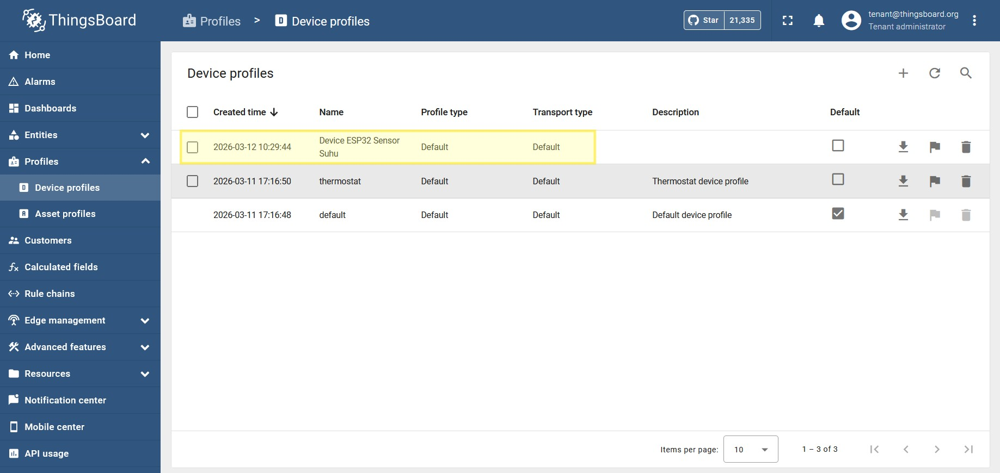
Continuing the device profile setup, this screenshot highlights the alarm rules section. Administrators can define specific conditions that trigger alarms, such as a temperature exceeding a certain threshold, ensuring that critical issues are flagged automatically for immediate action by the operators.

### 8.8. Manual Device Provisioning
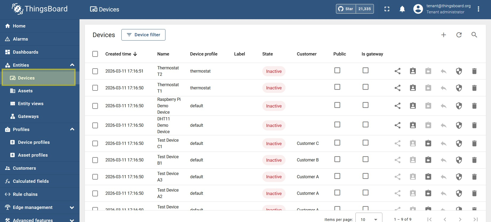
This screenshot shows the process of adding a new device to the platform. By clicking the plus button and filling out the basic information such as the device name and label, users can manually provision individual hardware units into the system for tracking.

### 8.9. Mapping Device to Profile
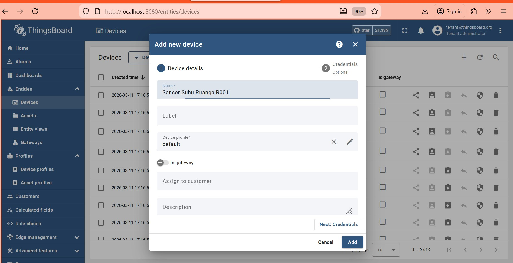
After defining the basic info, we select the appropriate Device Profile for the new device. This ensures the device inherits all the pre-configured settings, alarm rules, and data processing logic assigned to that profile, significantly simplifying the deployment of new hardware units.

### 8.10. Device Security and Credentials
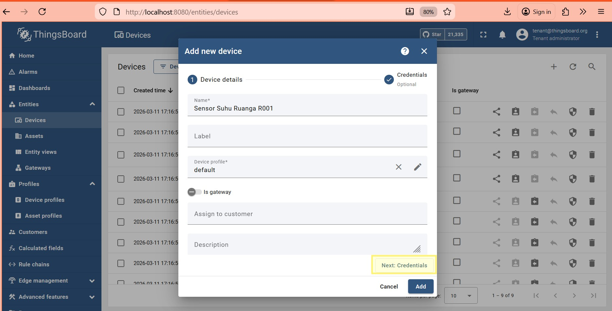
Credential management is a critical step in device security. This screen shows the configuration of connectivity credentials, allowing the administrator to choose between different types of authentication, such as Access Tokens or X.509 certificates, to ensure only authorized devices can connect.

### 8.11. Access Token Generation
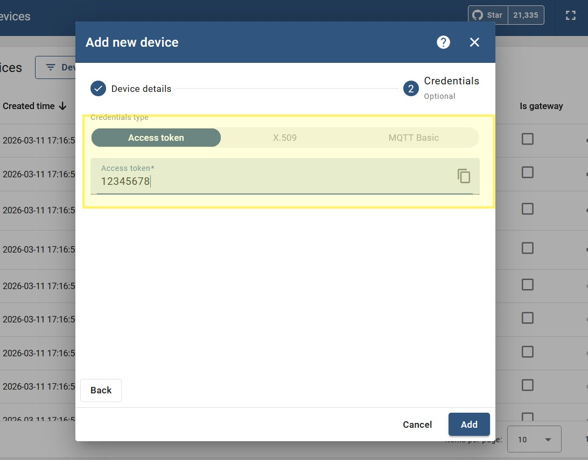
Here, a specific Access Token is being generated for the device. This unique token must be used by the physical device hardware (or simulation script) when communicating with the platform, providing a secure method for identifying and authenticating the incoming data stream.

### 8.12. HTTP Telemetry API Endpoint
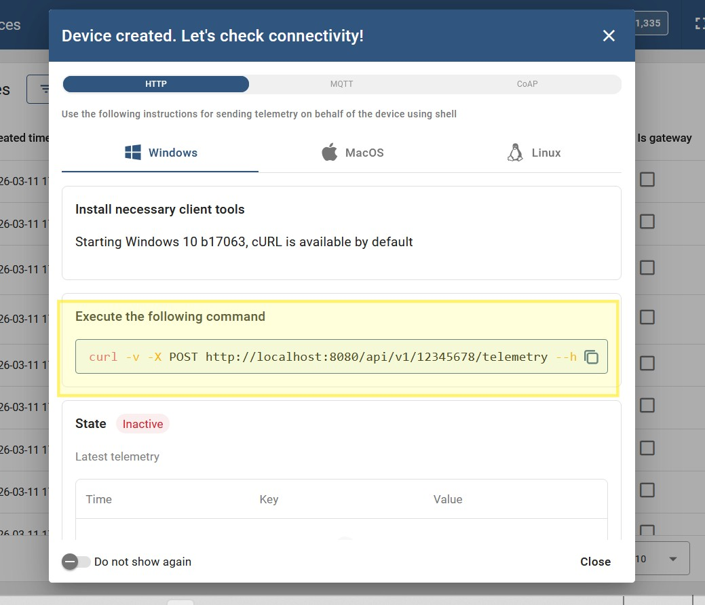
This screen provides technical details for HTTP connectivity. It includes the API endpoints and JSON formats required for a device to send telemetry data via HTTP POST requests, which is a common and easy-to-implement method for web-based IoT sensors and gateways.

### 8.13. MQTT Transport Configuration
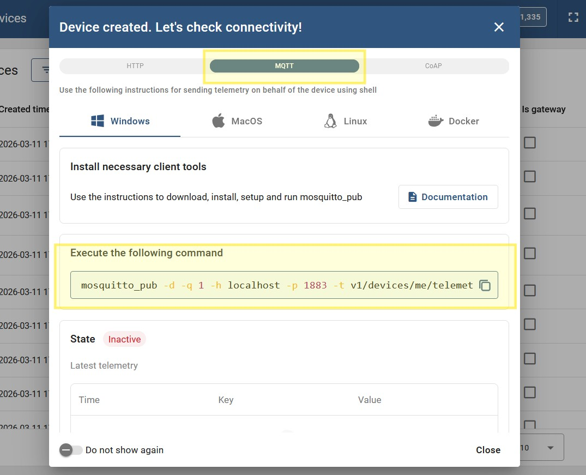
MQTT is one of the most popular protocols for IoT due to its lightweight nature. This screenshot shows the MQTT connection parameters, including the topic structure and authentication requirements, enabling devices to publish their sensor readings more efficiently over the network.

### 8.14. CoAP Protocol Support
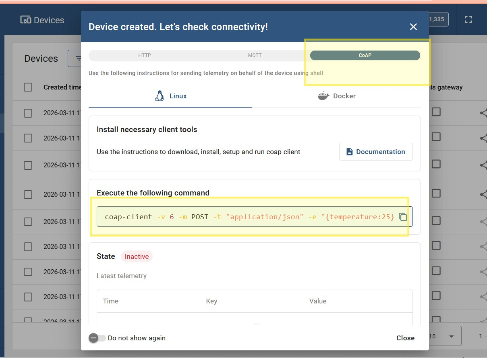
For extremely resource-constrained devices, CoAP is an excellent choice. This image shows the CoAP configuration settings provided by ThingsBoard, allowing developers to integrate specialized industrial or battery-powered sensors that require a minimal communication overhead while maintaining reliable data delivery.

### 8.15. Real-Time Telemetry Monitoring
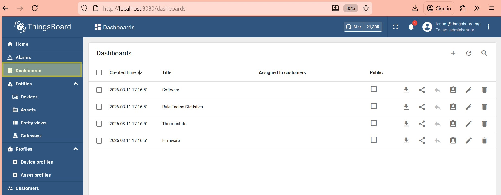
The monitoring dashboard demonstrates real-time data visualization. In this view, we can see the incoming telemetry values from various devices, displayed in a list format that allows administrators to quickly check the last known values and the health status of their sensor network.

### 8.16. Advanced Metric Visualization
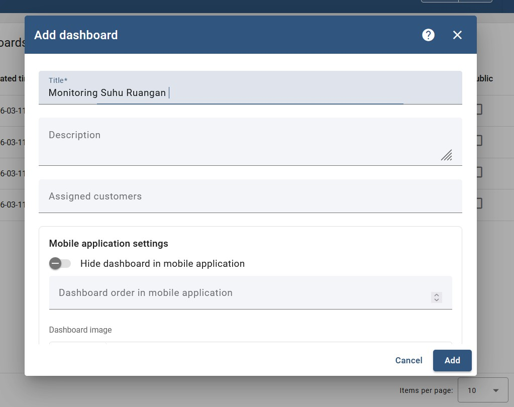
This additional monitoring view provides a different widget configuration, focusing on specific metrics that might be critical for a different user persona. It highlights the platform's flexibility in presenting the same data in multiple ways to suit various business needs and technical requirements.

### 8.17. Gauge and Index Tuning

This screen shows the detailed parameter settings for the secondary monitoring widgets. It ensures that the specific data keys are correctly mapped to the gauge or chart, providing accurate and reliable feedback to the operations team during their daily monitoring tasks.

### 8.18. Widget Selection Library
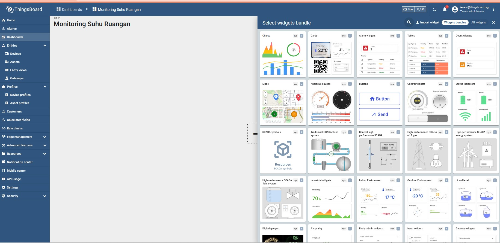
ThingsBoard offers a rich library of pre-built widgets. This image shows the widget selection screen, where users can choose from various categories like digital gauges, analog meters, or complex maps to best represent their data in a visually appealing and intuitive manner.

### 8.19. Historical Trend Analysis
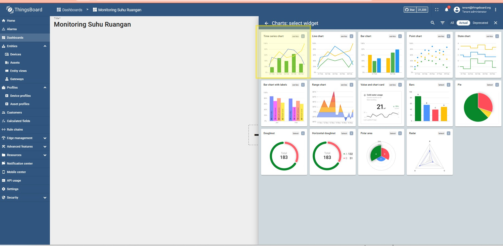
Timeseries widgets are essential for analyzing trends over time. This screen demonstrates selecting a historical data chart, which allows users to see how sensor values have changed in the past, helping in identifying patterns, anomalies, or long-term behavioral shifts in the monitored environment.

### 8.20. Mapping Data Keys to Visuals
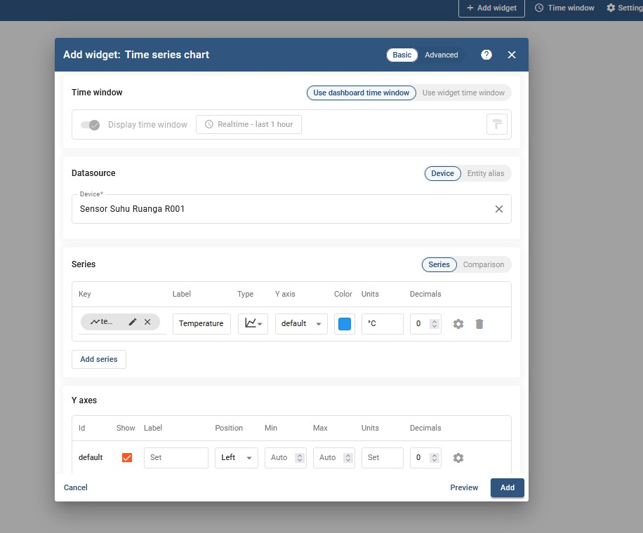
After selecting the widget, we configure its data source. This screenshot shows the mapping of timeseries data keys (like temperature or humidity) to the chart elements, ensuring that the visual representation accurately reflects the underlying data stored in the PostgreSQL database.

### 8.21. Detailed Widget Data Configuration
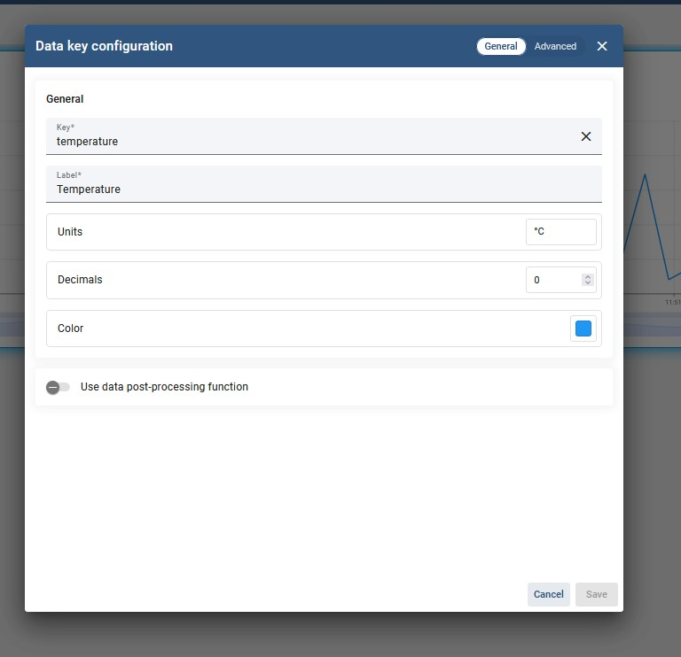
This screen shows the detailed configuration for the timeseries widget, allowing for fine-tuning of the data processing and visualization parameters. It ensures that the specific metrics are captured and displayed with the highest precision for the monitoring team.

### 8.22. Time Window and Refresh Cycles
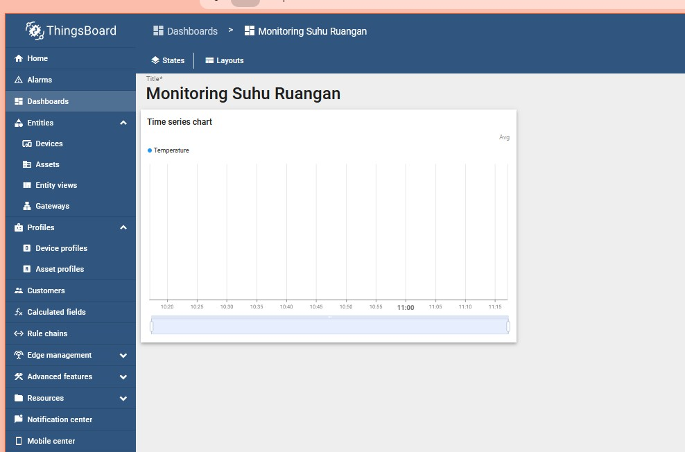
The final step in widget configuration involves setting the time window and refresh intervals. This ensures the chart stays up-to-date with real-time data while allowing users to zoom in or out of specific historical periods to perform detailed forensic analysis of the sensor logs.

### 8.23. Device Telemetry Simulation
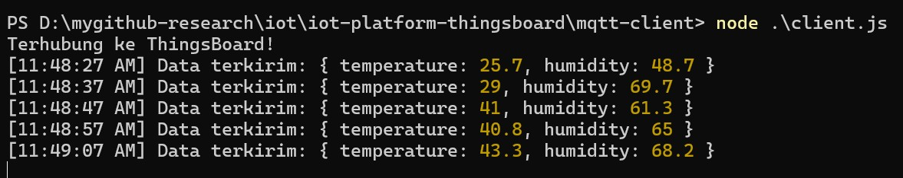
This terminal screenshot shows an external simulation client sending live data to ThingsBoard. It confirms that the external connectivity is working as expected, with the platform receiving and acknowledging the JSON payloads sent by the MQTT or HTTP client script.

### 8.24. Global Device Fleet Status
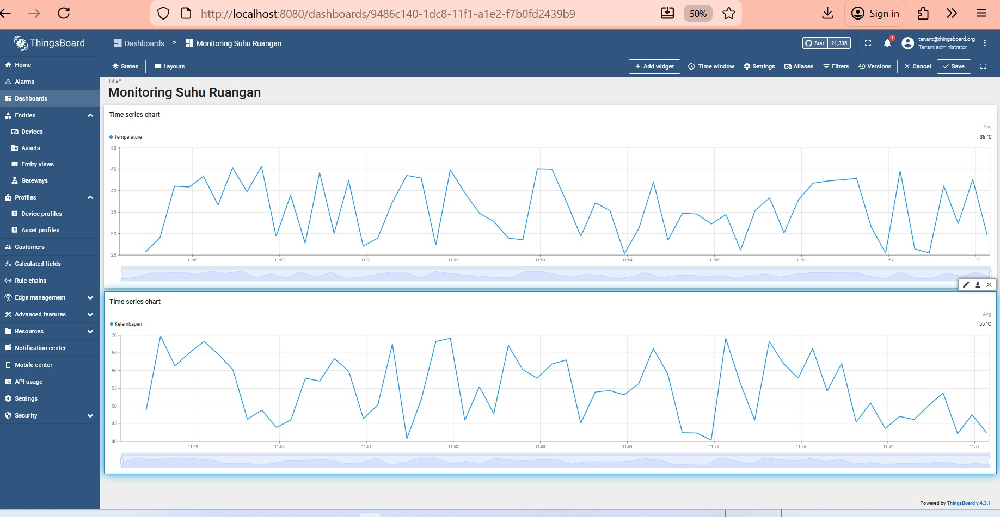
This dashboard view shows all provisioned devices in a single unified interface. It provides a comprehensive status check for the entire fleet, making it easy to identify which devices are currently online, which are inactive, and if any have triggered critical alarms.

### 8.25. Public Dashboard Visibility
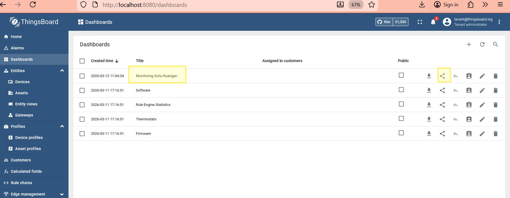
ThingsBoard allows sharing dashboards with external stakeholders. This screen shows the security settings where a dashboard can be made "Public", allowing anyone with the link to view the data without needing a formal user account on the platform, which is great for transparency.

### 8.26. External Access URL Generation
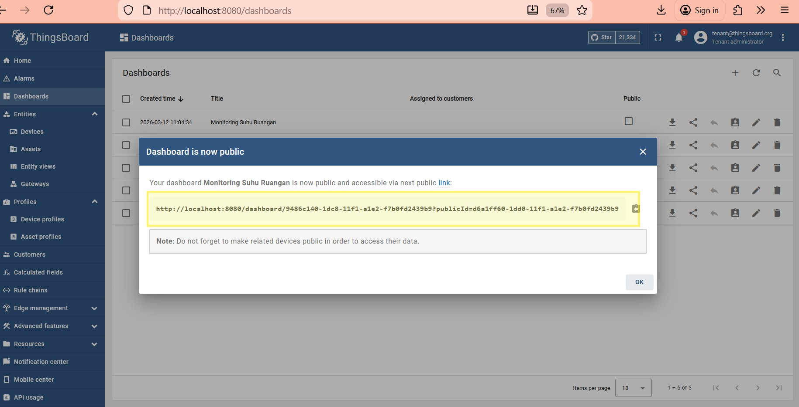
Once a dashboard is made public, a unique sharing link is generated. This screenshot shows the generated URL that can be distributed to clients or embedded in other websites, providing a secure and controlled way to present IoT insights to a broader audience.

### 8.27. Public Data Permissions
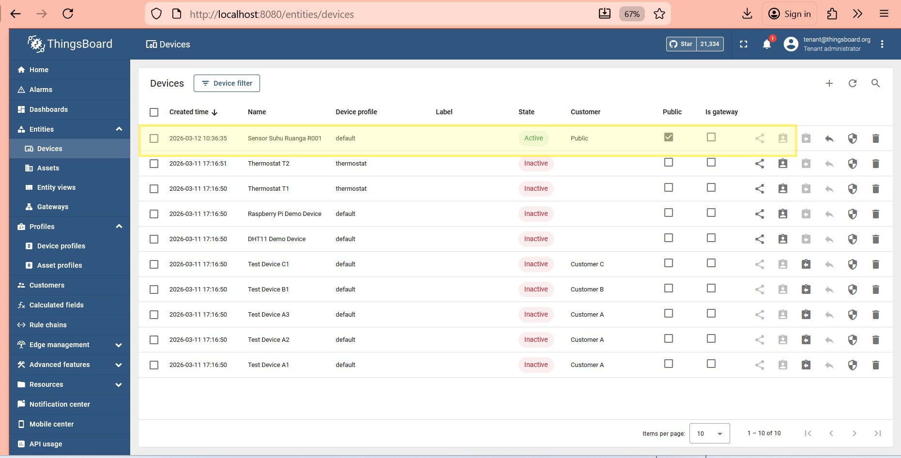
In addition to the dashboard, the underlying devices must also be set to public for their data to be visible. This image shows the toggle for individual devices, ensuring that the platform's security model correctly handles data visibility for anonymous public viewers.

### 8.28. Live Public Monitoring View
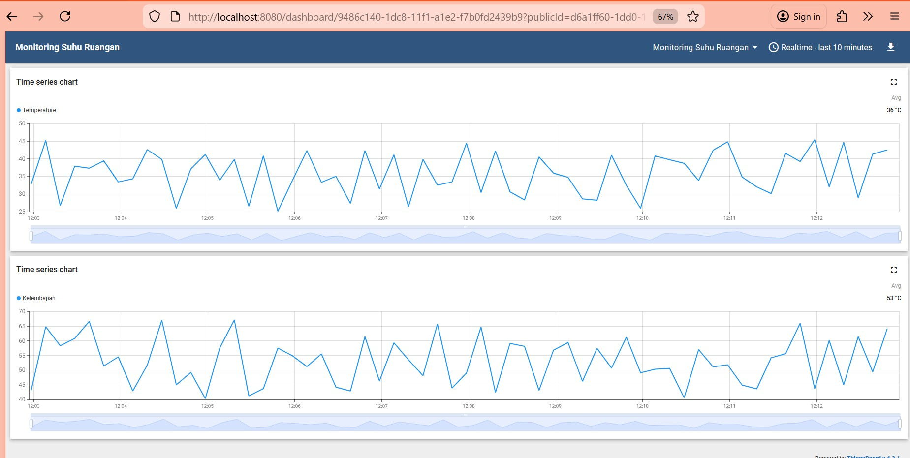
This screenshot displays the final public-facing dashboard. It is a clean, read-only view that focuses entirely on the visualizations, proving that the sharing mechanism is successful and the data is being correctly rendered for external parties in real-time.

### 8.29. Mobile Application Setup
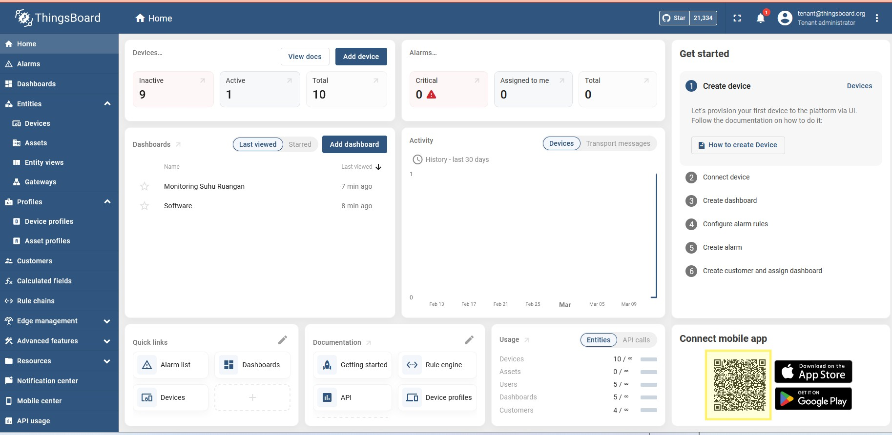
ThingsBoard supports mobile access for monitoring on the go. This screen shows the initial setup for mobile connectivity, allowing administrators to enable mobile application support and configure the necessary settings for users to access their dashboards from Android or iOS devices.

### 8.30. Responsive Mobile Layouts
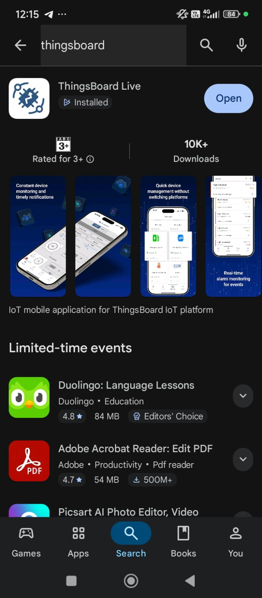
In this step, we are configuring the mobile dashboard layout. Users can customize how components appear on smaller screens, ensuring that the mobile user experience is optimized for touch interaction and quick reading while in the field or away from their desks.

### 8.31. QR Code Pairing
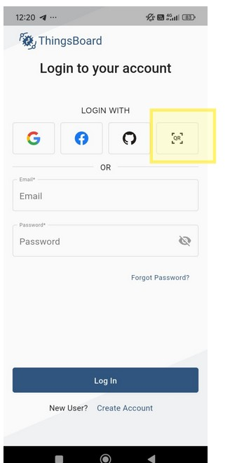
To simplify the mobile setup, ThingsBoard provides a QR code for quick configuration. By scanning this code with the mobile app, users can instantly link their device to the platform without manually typing in complex server addresses or long, cumbersome authentication tokens.

### 8.32. Mobile Authentication Success
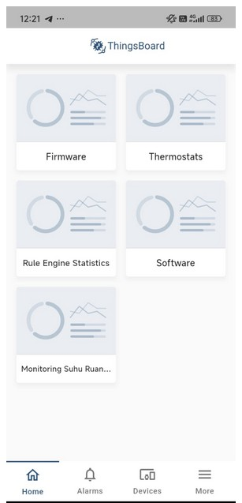
This image shows the mobile application's connection status. It confirms that the smartphone has successfully authenticated with the ThingsBoard server and is ready to load the assigned dashboards, providing a truly portable and flexible monitoring solution for professional IoT users.

### 8.33. MobileField Monitoring on Smartphone
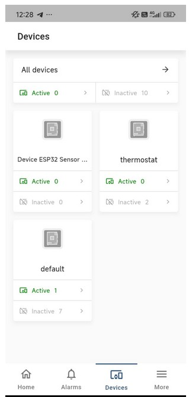

The final screenshot shows the live data appearing on the mobile application. It demonstrates that the end-to-end connectivity from the sensor device to the platform and finally to the user's mobile screen is complete, enabling real-time responses to environment changes from anywhere.

© 2024 ThingsBoard IoT Project. Documented with care for professional deployment.
